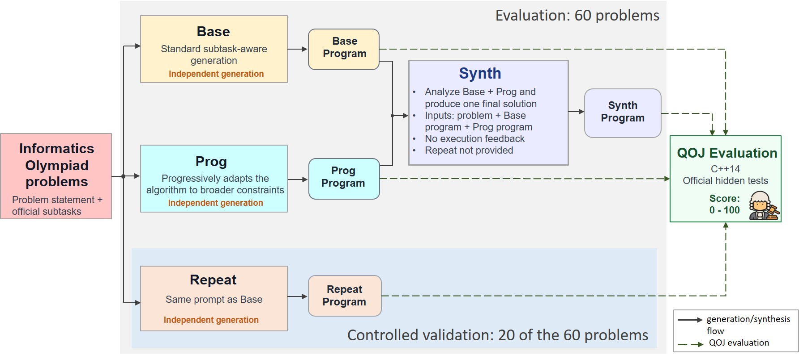

# Multi-Path Solution Synthesis for LLM Code Generation

Large language models (LLMs) can generate different solutions to the same programming problem, often using different algorithms on different parts of the problem. We study whether an LLM can produce a stronger final solution by synthesizing multiple candidate solutions. We evaluate this idea on 60 informatics Olympiad problems. For each problem, we generate two independent candidates using a baseline subtask-aware strategy (Base) and a progressive subtask strategy (Prog). Synth receives the Base and Prog programs and produces one final solution without receiving execution feedback. Base and Prog achieve average online judge scores of 62.4 and 73.4, while Synth reaches 87.6 and fully solves 48 of the 60 problems. On a controlled subset of 20 problems, an independent repeat of Base (Repeat) scores 63.8 compared with 79.9 for Synth, providing supporting evidence that synthesis offers an advantage beyond another generation attempt. These results show that multiple candidate solutions can help an LLM produce stronger programming solutions.

## 📖Workflow

The main experimental workflow is shown below.




## 🎯Experimental Design

We study four experimental conditions:

- **Base**: a subtask-aware baseline generation strategy.
- **Prog**: a progressive subtask strategy that moves from simpler official subtasks toward the full problem.
- **Repeat**: an independent repeat using the same prompt and problem information as Base. Repeat is used only on the controlled 20-problem set.
- **Synth**: a synthesis run that receives the original problem together with the Base and Prog programs and produces one final solution.

Base and Prog are generated independently. Synth does not receive QOJ scores, hidden test results, execution results, correctness labels, or the Repeat output during generation.

All programs are evaluated using QOJ with the C++14 environment and official hidden test cases. Scores range from 0 to 100, where 100 indicates a complete solution.

## 📁Repository Structure

```text
mpss_llm/
│
├── README.md
│
├── figure/
│   └── workflow.png
│
├── prompts/
│   ├── base_prompt.txt
│   ├── prog_prompt.txt
│   ├── repeat_prompt.txt
│   └── synth_prompt.txt
│
├── results/
│   ├── results_60.csv
│   ├── controlled20_results.csv
│   └── qoj_submissions.csv
│
├── generations/
│   ├── initial40/
│   │   └── <problem_id>/
│   │       ├── Base.cpp
│   │       ├── Prog.cpp
│   │       └── Synth.cpp
│   │
│   └── controlled20/
│       └── <problem_id>/
│           ├── Base.cpp
│           ├── Prog.cpp
│           ├── Repeat.cpp
│           └── Synth.cpp
│
└── scripts/
    ├── generate.py
    ├── extract_code.py
    └── analyze_results.py
```

The exact script filenames may differ from the structure above. The repository should contain the scripts used for the final generation, extraction, and result analysis.

## ✏️Prompts

The `prompts/` folder contains the exact prompt templates used in the final experiments:

- `base_prompt.txt`
- `prog_prompt.txt`
- `repeat_prompt.txt`
- `synth_prompt.txt`

Repeat uses the same generation prompt as Base but is executed as a separate independent run.

The prompt files should preserve the wording used in the completed experiments. Dynamic fields such as the problem statement, official subtasks, Base program, and Prog program may be represented using placeholders where appropriate.

## 🎲Problem Sets

The study contains 60 SubtaskEval problems.

- **Initial 40**: used for the main study of Base, Prog, and Synth.
- **Controlled 20**: used for Base, Prog, Repeat, and Synth.

The controlled 20-problem set was fixed before the new generations were evaluated and was not selected based on the performance of the four conditions.

## 🔓Generated Solutions

The `generations/` folder contains the generated C++ programs for each problem.

For the initial 40 problems:

```text
generations/initial40/<problem_id>/
├── Base.cpp
├── Prog.cpp
└── Synth.cpp
```

For the controlled 20 problems:

```text
generations/controlled20/<problem_id>/
├── Base.cpp
├── Prog.cpp
├── Repeat.cpp
└── Synth.cpp
```

If a generation failed to produce usable code, the corresponding result is preserved as a failure in the result files instead of being manually repaired or regenerated based on judge performance.

## 📊QOJ Results

The `results/` folder contains the canonical evaluation results.

### `results_60.csv`

Contains one row per problem with the final scores for Base, Prog, and Synth. Repeat is included for the controlled 20 problems and left blank for the initial 40.

Suggested columns:

```text
problem_id,problem_name,set,Base,Prog,Repeat,Synth
```

### `controlled20_results.csv`

Contains the detailed results for the controlled 20-problem evaluation, including Base, Prog, Repeat, Synth, and derived comparisons when needed.

### `qoj_submissions.csv`

Contains the QOJ submission records used to verify the reported scores.

Suggested columns:

```text
problem_id,condition,submission_id,score,status
```

Compilation failures are treated as score 0 in the analysis.

## 🚀Reproducing the Analysis

The `scripts/` folder contains a clean reference implementation of the final experimental protocol and analysis:

- `generate.py` reproduces the Base, Prog, Repeat, and Synth generation pipeline using the frozen 40-problem and 20-problem sets and the exact prompt templates in `prompts/`.
- `extract_code.py` extracts the single C++ code block required by the generation protocol. If a response does not contain exactly one C++ block, the extraction is preserved as a failure.
- `analyze_results.py` reproduces the aggregate results and statistical comparisons reported in the paper from `results/results_60.csv`.

### Generation

Set an OpenAI API key and run:

```bash
export OPENAI_API_KEY=YOUR_KEY
python scripts/generate.py --set all
```

## 🎬Main Results

Across all 60 problems:

| Method | Average score | Full solves |
|---|---:|---:|
| Base | 62.4 | 33/60 |
| Prog | 73.4 | 39/60 |
| Best(Base, Prog) | 78.2 | 43/60 |
| **Synth** | **87.6** | **48/60** |

On the controlled 20-problem set:

| Method | Average score | Full solves |
|---|---:|---:|
| Base | 43.9 | 7/20 |
| Prog | 69.3 | 11/20 |
| Repeat | 63.8 | 8/20 |
| Best(Base, Prog) | 70.9 | 12/20 |
| **Synth** | **79.9** | **14/20** |

## ⭐Notes

- All candidate and synthesis generations use GPT-5.6 with medium reasoning.
- Model outputs are evaluated independently by QOJ using the official hidden test cases under a fixed C++14 environment.
- No QOJ scores, execution results, hidden test outcomes, or correctness labels are provided to GPT-5.6 during generation or synthesis.
- Generated programs are preserved without manual repair or result-based regeneration.
- The initial local condition names A, C, R, and D correspond to Base, Prog, Repeat, and Synth in the paper and repository.
